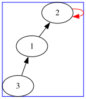
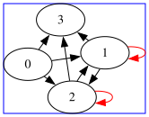
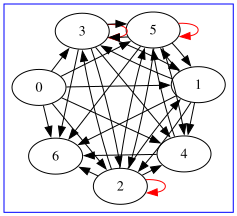

# 4.1

## 2.

### (1)

\[
\left[
\begin{matrix}
0 & 1 & 0 \\
0 & 1 & 0 \\
1 & 0 & 0
\end{matrix}
\right]
\]

### (2)

\[
\left[
\begin{matrix}
0 & 1 & 1 & 1 \\
0 & 1 & 1 & 1 \\
0 & 1 & 1 & 1 \\
0 & 0 & 0 & 0
\end{matrix}
\right]
\]

### (3)

\[
\left[
\begin{matrix}
0 & 1 & 1 & 1 & 1 & 1 & 1 \\
0 & 0 & 1 & 1 & 1 & 1 & 1 \\
1 & 1 & 1 & 1 & 1 & 1 & 1 \\
1 & 1 & 1 & 1 & 1 & 1 & 1 \\
0 & 0 & 0 & 0 & 0 & 1 & 1 \\
1 & 1 & 1 & 1 & 1 & 1 & 1 \\
0 & 0 & 0 & 0 & 0 & 0 & 0
\end{matrix}
\right]
\]

## 3.
$一元关系数=2^n ,二元关系数=2^{n^2},m元关系数=2^{n^m}$

## 4.
最少：$\varnothing$，0个元素
最多：$A\times A，n^2个元素 $

# 4.2

## 1.
(a)自反、反对称、传递
(b)反对称、传递
(c)自反、对称、传递
(d)反自反、反对称
(e)反自反、反对称
(f)自反、反对称、传递
还有对称

## 2.

### (1) $ A={0,1,\dots,12} $
$$
R_1:对称\\
R_2:对称，传递\\
R_3:反自反，对称\\
R_4:自反，对称，反对称，传递\\
R_5:反对称
$$

### (2) $ A=\mathbb{I} $
$$
R_1: 对称\\
R_2: 对称，传递\\
R_3: 反自反，对称\\
R_4: 自反，对称，传递\\
R_5: 反对称
$$

## 4.

### (a)
\[
\begin{bmatrix}
0&0&0\\
1&0&1\\
1&0&0
\end{bmatrix}
\]
- 反自反
- 反对称
- 传递
### (b)

\[
\begin{bmatrix}
0&1&1\\
1&0&1\\
1&1&0
\end{bmatrix}
\]
- 反自反
- 对称
### (c)

\[
\begin{bmatrix}
0&1&1\\
1&0&0\\
0&0&1
\end{bmatrix}
\]
- 无

# 4.3
  
## 2.

| R1, R2 的性质 | $R_{1} \cup R_{2}$ | $R_{1} \cap R_{2}$ | $R_{1} - R_{2}$ | $A \times A - R_{1}$ | $\widetilde{R_{1}}$ | $R_{1} \circ R_{2}$ |
| --- | --- | --- | --- | --- | --- | --- |
| 自反的 | ✓ | ✓ | ✗ (E1) | ✗ (E2) | ✓ | ✓ |
| 反自反的 | ✓ | ✓ | ✓ | ✗ (E3) | ✓ | ✗ (E4) |
| 对称的 | ✓ | ✓ | ✓ | ✓ | ✓ | ✗ (E5) |
| 反对称的 | ✗ (E6) | ✓ | ✓ | ✗ (E7) | ✓ | ✗ (E8) |
| 传递的 | ✗ (E9) | ✓ | ✗ (E10) | ✗ (E11) | ✓ | ✗ (E12) |

### 反例说明
- **E1**  
  $A=\{1\}$，$R_1=\{(1,1)\}$，$R_2=\{(1,1)\}$。  
  $R_1-R_2=\varnothing$，非自反。

- **E2**  
  $A=\{1\}$，$R_1=\{(1,1)\}$。  
  $A\times A-R_1=\varnothing$，非自反。

- **E3**  
  $A=\{1\}$，$R_1=\varnothing$（反自反）。  
  补集 $=\{(1,1)\}$，非反自反。

- **E4**  
  $A=\{1,2\}$，$R_1=\{(1,2)\}$，$R_2=\{(2,1)\}$。  
  $R_1\circ R_2=\{(1,1)\}$，非反自反。

- **E5**  
  $A=\{1,2,3\}$，$R_1=\{(1,2),(2,1)\}$，$R_2=\{(2,3),(3,2)\}$。  
  $R_1\circ R_2=\{(1,3)\}$，缺少 $(3,1)$，非对称。

- **E6**  
  $A=\{1,2\}$，$R_1=\{(1,2)\}$，$R_2=\{(2,1)\}$。  
  并集含 $(1,2),(2,1)$，违反反对称。

- **E7**  
  $A=\{1,2\}$，$R_1=\{(1,1),(2,2)\}$（反对称）。  
  补集含 $(1,2),(2,1)$，违反反对称。

- **E8**  
  $A=\{1,2,3,4\}$，$R_1=\{(1,3),(2,4)\}$，$R_2=\{(3,2),(4,1)\}$。  
  $R_1\circ R_2=\{(1,2),(2,1)\}$，违反反对称。

- **E9**  
  $A=\{1,2,3\}$，$R_1=\{(1,2)\}$，$R_2=\{(2,3)\}$。  
  并集缺少 $(1,3)$，非传递。

- **E10**  
  $A=\{1,2,3\}$，$R_1=\{(1,2),(2,3),(1,3)\}$，$R_2=\{(1,3)\}$。  
  $R_1-R_2=\{(1,2),(2,3)\}$，非传递。

- **E11**  
  $A=\{1,2,3\}$，$R_1=\{(1,1),(2,2),(3,3)\}$。  
  补集含 $(1,2),(2,1)$ 但缺 $(1,1)$，非传递。

- **E12**  
  $A=\{1,2,3,4\}$，$R_1=\{(1,3),(2,4)\}$，$R_2=\{(3,2),(4,1)\}$。  
  $R_1\circ R_2=\{(1,2),(2,1)\}$，非传递。

## 3.

## (1) 计算

- **$R\circ S$**  
  由 $(a,c)$ 且 $c\to\{c,d\}$，得 $(a,c),(a,d)$；  
  由 $(c,b)$ 且 $b\to a$，得 $(c,a)$；  
  由 $(c,d)$ 且 $d\to a$，得 $(c,a)$；  
  由 $(d,b)$ 且 $b\to a$，得 $(d,a)$。  
  $R\circ S=\{(a,c),(a,d),(c,a),(d,a)\}$。

- **$R\circ R$**  
  $a\to\{a,c\}$，再 $a\to\{a,c\}$、$c\to\{b,d\}$，得 $(a,a),(a,c),(a,b),(a,d)$；  
  $c\to\{b,d\}$，再 $b$ 无出边、$d\to b$，得 $(c,b)$。  
  $R\circ R=\{(a,a),(a,b),(a,c),(a,d),(c,b)\}$。

- **$S\circ R$**  
  $b\to a$，再 $a\to\{a,c\}$，得 $(b,a),(b,c)$；  
  $c\to\{c,d\}$，再 $c\to\{b,d\}$、$d\to b$，得 $(c,b),(c,d)$；  
  $d\to a$，再 $a\to\{a,c\}$，得 $(d,a),(d,c)$。  
  $S\circ R=\{(b,a),(b,c),(c,b),(c,d),(d,a),(d,c)\}$。

- **$S\circ S$**  
  $c\to\{c,d\}$，再 $c\to\{c,d\}$、$d\to a$，得 $(c,c),(c,d),(c,a)$。  
  其余起点无两步路径。  
  $S\circ S=\{(c,a),(c,c),(c,d)\}$。

---

## (2) 用关系矩阵验证

- $R$ 的矩阵
\[
M_R=\begin{bmatrix}
1&0&1&0\\
0&0&0&0\\
0&1&0&1\\
0&1&0&0
\end{bmatrix}
\]

- $S$ 的矩阵
\[
M_S=\begin{bmatrix}
0&0&0&0\\
1&0&0&0\\
0&0&1&1\\
1&0&0&0
\end{bmatrix}
\]

\[
\begin{aligned}
M_{R\circ S}&=M_R\circ M_S=
\begin{bmatrix}
0&0&1&1\\
0&0&0&0\\
1&0&0&0\\
1&0&0&0
\end{bmatrix}
\ \Longleftrightarrow\ \{(a,c),(a,d),(c,a),(d,a)\};\\[4pt]
M_{R\circ R}&=M_R\circ M_R=
\begin{bmatrix}
1&1&1&1\\
0&0&0&0\\
0&1&0&0\\
0&0&0&0
\end{bmatrix}
\ \Longleftrightarrow\ \{(a,a),(a,b),(a,c),(a,d),(c,b)\};\\[4pt]
M_{S\circ R}&=M_S\circ M_R=
\begin{bmatrix}
0&0&0&0\\
1&0&1&0\\
0&1&0&1\\
1&0&1&0
\end{bmatrix}
\ \Longleftrightarrow\ \{(b,a),(b,c),(c,b),(c,d),(d,a),(d,c)\};\\[4pt]
M_{S\circ S}&=M_S\circ M_S=
\begin{bmatrix}
0&0&0&0\\
0&0&0&0\\
1&0&1&1\\
0&0&0&0
\end{bmatrix}
\ \Longleftrightarrow\ \{(c,a),(c,c),(c,d)\}.
\end{aligned}
\]

---

## 4.

记关系的逆为 $\widetilde{T}=\{(y,x)\mid (x,y)\in T\}$。有一般恒等式
\[
\widetilde{(R\circ S)}=\widetilde{S}\circ \widetilde{R}.
\]
若 $R,S$ 对称，则 $\widetilde{R}=R,\ \widetilde{S}=S$，于是
\[
\widetilde{(R\circ S)}=S\circ R.
\]
因此
\[
R\circ S \text{ 对称}
\ \Longleftrightarrow\ 
R\circ S=\widetilde{(R\circ S)}
\ \Longleftrightarrow\ 
R\circ S=S\circ R.
\]
证毕。

## 5.

### (1)
**($\Rightarrow$)** 若 $R$ 反自反，则对任意 $a\in A$，$(a,a)\notin R$，故 $I_A$ 中所有元素都不在 $R$ 中，$I_A\cap R=\varnothing$。
**($\Leftarrow$)** 若 $I_A\cap R=\varnothing$，则任意 $a\in A$ 的 $(a,a)\notin R$，故 $R$ 反自反。

### (2) 
**($\Rightarrow$)** 设 $R$ 反对称。任取 $(x,y)\in R\cap\tilde R$，则 $(x,y)\in R$ 且 $(y,x)\in R$。反对称给出 $x=y$，于是 $(x,y)\in I_A$。故 $R\cap\tilde R\subseteq I_A$。
**($\Leftarrow$)** 设 $R\cap\tilde R\subseteq I_A$。若 $(x,y)\in R$ 且 $(y,x)\in R$，则 $(x,y)\in R\cap\tilde R\subseteq I_A$，从而 $x=y$。故 $R$ 反对称。

### (3) 
**($\Rightarrow$)** 若 $R$ 传递。任取 $(x,z)\in R\circ R$，则存在 $y$ 使 $(x,y)\in R$ 且 $(y,z)\in R$。传递性给出 $(x,z)\in R$，故 $R\circ R\subseteq R$。
**($\Leftarrow$)** 若 $R\circ R\subseteq R$。任取 $(x,y)\in R,(y,z)\in R$，由复合得 $(x,z)\in R\circ R\subseteq R$，故 $R$ 传递。

## 9.

## (1) 反传递关系的例子
取 \(A=\mathbb Z\)，定义 \(xRy\iff y=x+1\)。  
若 \(xRy\) 且 \(yRz\)，则 \(z=x+2\)，而 \(xRz\) 要求 \(z=x+1\)，矛盾，故反传递。

## (2) 证明：\(R\) 反传递 \(\iff\ R^2\cap R=\varnothing\)

**\(\Rightarrow\)**  
  设 \(R\) 反传递。若 \((x,z)\in R^2\cap R\)，则一方面 \((x,z)\in R\)，另一方面存在 \(y\) 使 \(xRy\land yRz\)。  
  反传递给出 \(\neg(xRz)\)，与 \((x,z)\in R\) 矛盾。故 \(R^2\cap R=\varnothing\)。

**\(\Leftarrow\)**  
  设 \(R^2\cap R=\varnothing\)。任取 \(xRy\land yRz\)，于是 \((x,z)\in R^2\)。  
  若 \(xRz\) 成立，则 \((x,z)\in R^2\cap R\)，与空交矛盾。故 \(\neg(xRz)\)。  
  因而 \(R\) 反传递。

∎

