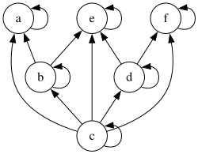

# 4.4
## 7.

证明 $\pi_2$ 是 $A\cap B$ 的一个划分：

 
- **（两两不交）** 若 $i\ne j$，因 $A_i\cap A_j=\varnothing$（划分块互不相交），故
  \[
  (A_i\cap B)\cap(A_j\cap B)=(A_i\cap A_j)\cap B=\varnothing .
  \]
- **（并成整体）** 任取 $x\in A\cap B$。因 $x\in A$ 且 $\pi_1$ 划分 $A$，存在唯一 $k$ 使 $x\in A_k$，于是 $x\in A_k\cap B$，且该集合在 $\pi_2$ 中。故
  \[
  \bigcup\pi_2=(A_1\cap B)\cup\cdots\cup(A_n\cap B)=(A_1\cup\cdots\cup A_n)\cap B=A\cap B .
  \]
综上，$\pi_2$ 为 $A\cap B$ 的划分。

## 9.
设 $R_1$、$R_2$ 分别是 $A$、$B$ 上的等价关系，定义
\[
R_3=\{\langle\langle x_1,y_1\rangle,\langle x_2,y_2\rangle\rangle\mid \langle x_1,x_2\rangle\in R_1\ \land\ \langle y_1,y_2\rangle\in R_2\}
\]
于 $A\times B$ 上。证 $R_3$ 为等价关系：

- **自反**：任取 $(x,y)\in A\times B$。因 $R_1$、$R_2$ 自反，有 $xR_1 x$、$yR_2 y$，故 $\langle(x,y),(x,y)\rangle\in R_3$。
- **对称**：若 $\langle(x_1,y_1),(x_2,y_2)\rangle\in R_3$，则 $x_1R_1x_2$ 且 $y_1R_2y_2$。由 $R_1$、$R_2$ 的对称性得 $x_2R_1x_1$、$y_2R_2y_1$，从而 $\langle(x_2,y_2),(x_1,y_1)\rangle\in R_3$。
- **传递**：若 $\langle(x_1,y_1),(x_2,y_2)\rangle,\ \langle(x_2,y_2),(x_3,y_3)\rangle\in R_3$，则 $x_1R_1x_2,\ x_2R_1x_3$ 与 $y_1R_2y_2,\ y_2R_2y_3$。由 $R_1$、$R_2$ 的传递性得 $x_1R_1x_3,\ y_1R_2y_3$，故 $\langle(x_1,y_1),(x_3,y_3)\rangle\in R_3$。

因此 $R_3$ 是 $A\times B$ 上的等价关系。 

## 10.

1) **$\pi_1\cup\pi_2$：不是。**  
   可能不两两不交。反例：$A=\{1,2\}$，$\pi_1=\big\{\{1\},\{2\}\big\}$，$\pi_2=\big\{\{1,2\}\big\}$。  
   则 $\pi_1\cup\pi_2=\big\{\{1\},\{2\},\{1,2\}\big\}$，存在重叠，违背划分的互不相交条件。

2) **$\pi_1\cap\pi_2$：不是。**  
   可能并不覆盖 $A$（甚至可能为空家族）。仍用上例：$\pi_1\cap\pi_2=\varnothing$，显然并非 $A$ 的划分。

3) **$\pi_1-\pi_2$：不是。**  
   删除 $\pi_2$ 中也出现的块后，可能无法覆盖 $A$。反例：$A=\{1,2\}$，$\pi_1=\big\{\{1\},\{2\}\big\}$，$\pi_2=\pi_1$。  
   则 $\pi_1-\pi_2=\varnothing$，不覆盖 $A$。

4) **$\big(\pi_1\cap(\,\pi_2-\pi_1\,)\big)\cup\pi_1$：是**  
   $\pi_1\cap(\pi_2-\pi_1)=\varnothing$，  
   因而该式化简为 $\varnothing\cup\pi_1=\pi_1$，自然是 $A$ 的划分。

# 4.5
## 1.

### (1) 判断给定关系
- $a\preceq b$：**否**
- $b\preceq a$：**是**
- $c\preceq e$：**是**
- $e\preceq f$：**否**
- $d\preceq f$：**是**
- $c\preceq f$：**是**

### (2)$\preceq$关系图

### (3) 极大/极小元、最大/最小元、上/下界、sup、inf

#### (a) 子集 $A$
- 极大元：$\{a,e,f\}$；极小元：$\{c\}$  
- 最大元：**无**；最小元：$c$
- 上界集：**无**（$a,e,f$ 互不可比）；下界集：$\{c\}$
- $\sup A$：**不存在**；$\inf A$：$c$

#### (b) 子集 $\{b,d\}$
- 极大元：$\{b,d\}$；极小元：$\{b,d\}$
- 最大元：**无**；最小元：**无**
- 上界集：$\{e\}$；下界集：$\{c\}$
- $\sup\{b,d\}=e$；$\inf\{b,d\}=c$

#### (c) 子集 $\{b,e\}$
- 极大元：$\{e\}$；极小元：$\{b\}$
- 最大元：$e$；最小元：$b$
- 上界集：$\{e\}$；下界集：$\{b,c\}$
- $\sup\{b,e\}=e$；$\inf\{b,e\}=b$

#### (d) 子集 $\{b,d,e\}$
- 极大元：$\{e\}$；极小元：$\{b,d\}$
- 最大元：$e$；最小元：**无**
- 上界集：$\{e\}$；下界集：$\{c\}$
- $\sup\{b,d,e\}=e$；$\inf\{b,d,e\}=c$

## 4.

(1)–(4) **全都为真**。

### (1) 若 $R$ 是偏序，则 $R'$ 也是偏序

偏序需验证**自反、反对称、传递**：

- **自反**：任取 $x\in B$。因 $R$ 在 $A$ 上自反，有 $\langle x,x\rangle\in R$；又 $\langle x,x\rangle\in B\times B$，故
  \[
  \langle x,x\rangle\in R\cap(B\times B)=R' .
  \]

- **反对称**：若 $\langle x,y\rangle\in R'$ 且 $\langle y,x\rangle\in R'$（其中 $x,y\in B$），则两者同属 $R$。由 $R$ 的反对称性可得 $x=y$。

- **传递**：若 $\langle x,y\rangle\in R'$ 与 $\langle y,z\rangle\in R'$（$x,y,z\in B$），则它们均在 $R$ 中；由 $R$ 的传递性得 $\langle x,z\rangle\in R$。又 $x,z\in B$，故 $\langle x,z\rangle\in B\times B$，从而 $\langle x,z\rangle\in R'$。

因此 $R'$ 是偏序。

### (2) 若 $R$ 是拟序，则 $R'$ 也是拟序

拟序只需**自反、传递**。以上(1)中“自反”“传递”的论证完全适用，故 $R'$ 为拟序。

### (3) 若 $R$ 是全序，则 $R'$ 也是全序

由(1)知 $R'$ 为偏序。再证**可比性**：任取 $x,y\in B$。由于 $R$ 在 $A$ 上为全序，必有 $\langle x,y\rangle\in R$ 或 $\langle y,x\rangle\in R$。同时 $x,y\in B$，于是对应的有序对也属于 $B\times B$，从而属于 $R'=R\cap(B\times B)$。因此 $R'$ 亦为全序。

### (4) 若 $R$ 是良序，则 $R'$ 也是良序

良序等价于“全序 + 每个非空子集存在最小元”。由(3)知 $R'$ 已是全序。设 $C\subseteq B$ 且 $C\ne\varnothing$。则 $C$ 亦是 $A$ 的非空子集；由于 $R$ 良序，存在 $m\in C$，对任意 $x\in C$ 有 $\langle m,x\rangle\in R$。又 $m,x\in B$，故 $\langle m,x\rangle\in B\times B$，于是 $\langle m,x\rangle\in R'$。这表明 $m$ 是 $C$ 关于 $R'$ 的最小元。于是 $R'$ 良序。

