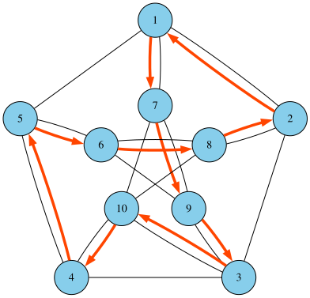

# 11.2

## 2. 

### (1)

记 \(G'=(V,E')\)，其中
\[
\{u,v\} \in E' \iff (u,v)\in E \text{ 或 } (v,u)\in E.
\]

下界:

- 无向连通图至少有 \(n-1\) 条边，因此
  \[
  |E'| \ge n-1.
  \]
- 对于每一条无向边 \(\{u,v\}\in E'\)，在原图 \(G\) 中至少有一条对应的有向边 \((u,v)\) 或 \((v,u)\)，因此
  \[
  m = |E| \ge |E'|.
  \]
  于是
  \[
  m \ge |E'| \ge n-1.
  \]

上界:

有向简单图中不允许有重边和自环。对每一对不同的顶点 \((u,v)\)（\(u\ne v\)），最多只能有一条有向边 \((u,v)\)。顶点有 \(n\) 个，有序对 \((u,v)\)（\(u\ne v\)）总数为：
\[
n(n-1)
\]
因此有向边数 \(m\) 满足
\[
m \le n(n-1).
\]

综上，在弱连通的前提下，有
\[
n-1 \le m \le n(n-1).
\]

### (2)

因为图仍然是简单有向图，不允许自环和重边，所以
\[
m \le n(n-1).
\]

下界:

对于强连通的 \(G\)（\(n\ge 2\)），每个顶点的入度和出度都至少为 1：

\[
\deg^-(v) \ge 1,\quad \deg^+(v) \ge 1.
\]

由上，
\[
m = \sum_{v\in V} \deg^-(v) \ge n.
\]

综上，强连通图的有向边数满足
\[
n\le m\le n(n-1)\quad (n\ge 2).
\]
（\(n=1\) 时只有一个点，无边，\(m=0\)）
## 4.

设无向简单图 \(G=\langle V,E\rangle\)，边 \(e=\{x,y\}\in E\)，并且 \(e\) 含于两个不同的基本回路中。记这两个基本回路为
\[
C_1 = e \cup P_1,\quad C_2 = e \cup P_2,
\]
其中 \(P_1,P_2\) 是从 \(x\) 到 \(y\) 的两条简单路径且 \(P_1\ne P_2\)，并且都不含 \(e\)。

若 \(P_1,P_2\) 除了端点 \(x,y\) 外无公共顶点，则 \(P_1\cup P_2\) 组成一个简单回路，且不含 \(e\)。

若它们在内部还有公共顶点，从 \(x\) 同时沿 \(P_1,P_2\) 前进，取它们第一次分叉点 \(u\) 和之后第一次相遇点 \(v\)。在 \(u,v\) 之间，\(P_1\) 给出一段简单路径 \(Q_1\)，\(P_2\) 给出一段简单路径 \(Q_2\)，且只在 \(u,v\) 交汇。于是 \(Q_1\cup Q_2\) 构成一个基本回路，也不含 \(e\)。

因此必存在一个不含 \(e\) 的基本回路。

# 11.4

## 2.

### (a)
从左往右从上往下编号为：
\[
\begin{matrix}
1 & 2 & 3 & 4\\
5 & 6 & 7 & 8\\
\end{matrix}    
\]
欧拉通路: $1\to2\to6\to7\to8\to3\to4\to7\to3\to2\to5\to1\to6\to5$

### (b)

顺时针方向编号为：1，2，3，4，5，6
欧拉回路: $1\to2\to3\to4\to5\to6\to2\to4\to6\to1\to3\to5\to1$

## 3.

### (a)

如图
### (b)
不是

## 4.
证明：

设 \(G\) 为 \(n\) 阶简单图，边数
\[
m=\frac{(n-1)(n-2)}{2}+2.
\]

任取一对不相邻顶点 \(u,v\)，有
\[
m = e(G) = e(G-\{u,v\}) + d(u)+d(v).
\]
删去 \(u,v\) 后剩下 \(n-2\) 个顶点，其诱导子图至多是完全图 \(K_{n-2}\)，故
\[
e(G-\{u,v\}) \le \binom{n-2}{2}.
\]
若存在一对不相邻顶点 \(u,v\) 满足
\[
d(u)+d(v)\le n-1,
\]
则
\[
m \le \binom{n-2}{2} + (n-1)
   = \frac{(n-1)(n-2)}{2} + 1.
\]

因此当
\[
m = \frac{(n-1)(n-2)}{2}+2
\]
时，不可能存在不相邻顶点 \(u,v\) 使得 \(d(u)+d(v)\le n-1\)，也就是说对一切不相邻顶点 \(x,y\) 都有
\[
d(x)+d(y) \ge n.
\]
由 Ore 定理可得 \(G\) 必为哈密尔顿图。

构造：

取一个顶点 \(v\)，令剩余 \(n-1\) 个顶点形成完全图 \(K_{n-1}\)，再从 \(K_{n-1}\) 中任选一点并让 \(v\) 与其相连
此时图的边数为
\[
m = \frac{(n-1)(n-2)}{2} + 1,
\]
但由于 \(v\) 仅与一个顶点相连，无法形成哈密尔顿回路。