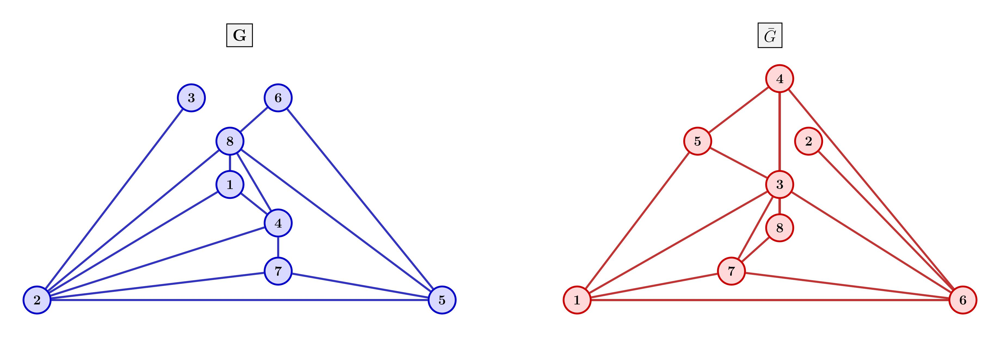
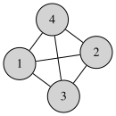

# 11.5

## 1.
设二分图两部分点集分别为 \(V_1,V_2\)，且 \(|V_1|=n_1,\ |V_2|=n_2,\ n_1+n_2\le n\)。则边数
\[
m\le |E(K_{n_1,n_2})|=n_1n_2.
\]
由 \((n_1-n_2)^2\ge0\) 得 \((n_1+n_2)^2\ge4n_1n_2\)，故
\[
n_1n_2\le \frac{(n_1+n_2)^2}{4}.
\]
又因 \(n_1+n_2\le n\)，所以
\[
\frac{(n_1+n_2)^2}{4}\le \frac{n^2}{4}.
\]
综上
\[
m\le n_1n_2\le \frac{(n_1+n_2)^2}{4}\le \frac{n^2}{4}.
\]

# 11.6

## 2.

## 5.

(1) \(G\) 连通
若 \(G\) 不连通，设其有 \(c\ge2\) 个连通分量。则有
\[
m\le 3n-6c \le 3\cdot7-12=9,
\]
与 \(m=15\) 矛盾，故 \(G\) 连通。

(2)每个面由 3 条边围成
由欧拉公式
\[
n-m+f=2 \Rightarrow 7-15+f=2 \Rightarrow f=10.
\]
设各面度数为 \(d_1,\dots,d_f\)，则
\[
\sum_{i=1}^f d_i = 2m = 30.
\]
简单平面图中 \(d_i\ge3\)，故
\[
30=\sum d_i \ge 3f = 30,
\]
从而每个 \(d_i=3\)。因此每个面均为三角形。

## 8.
若平面图 \(G\) 与其对偶图 \(G^*\) 同构，则称 \(G\) 为自对偶图。

(1) 

(2) 证明 \(m=2n-2\)。
设 \(G\) 为自对偶图，\(|V|=n, |E|=m\)，面数为 \(f\)。  
因 \(G\cong G^*\)，而 \(G^*\) 的顶点数等于 \(G\) 的面数，故 \(f=n\)。  
代入欧拉公式
\[
n-m+f=2
\]
得
\[
n-m+n=2 \Rightarrow m=2n-2.
\]
