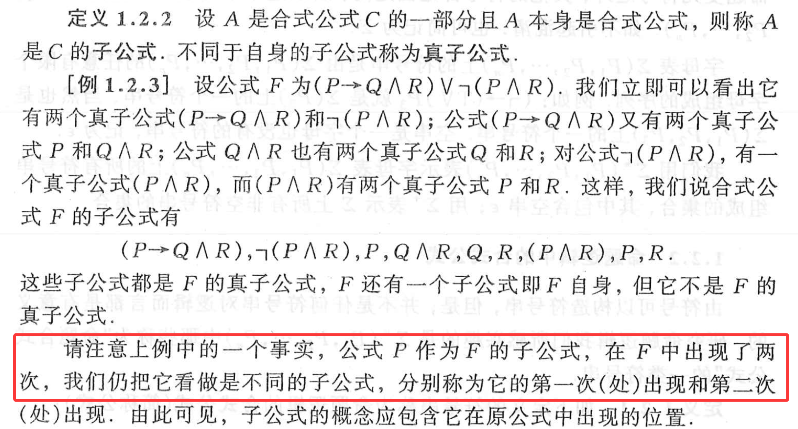
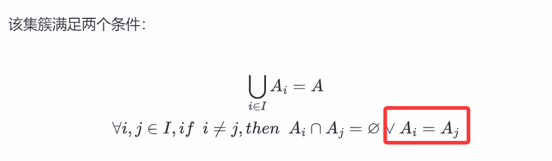
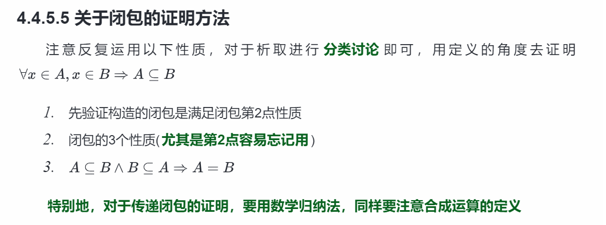
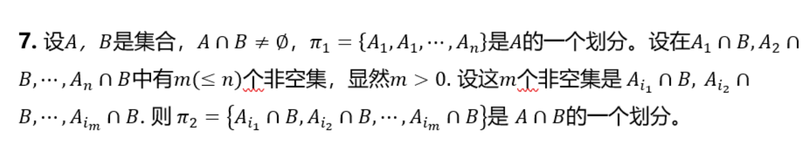
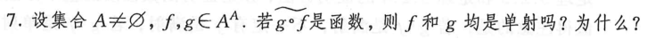

<h1 style="text-align:center; color:#2b6cb0;">重点整理</h1>

一、**命题逻辑**

提醒大家注意这个易错点，另外对于未确定真假的合式公式最好采用单线$ \rightarrow $ 。类似的，对于恒真的可以使用双线形式$ \Rightarrow $ 。内容难度不大，证明题会有多种证法，例如反证法、条件假设等方法

<b>重点</b> 
1. 合取析取范式要求每一项都是含有所有变量的。（也可以写作$\sum$求和形式，类似数电）
2. F或者T也算作范式之一（坑）
3. 证明序列的格式要求：【序号】【公式】【原因】（依据+序号）
4. 附加条件需要写成CP作为依据。
5. 注意极小全功能集的概念
6.  注意反证法和条件假设法是非常重要的证明方法，这二者都可以增多一个条件便于推理，对于析取式或者蕴含式（其实二者等价）使用起来效果更好

二、**集合**

1. 枚举法表示与元素是否重复出现无关。{1,2,2}={1,2}。注意我们是能够容忍集合中元素不满足互异性的，但在实际处理中，比如幂集计算的时候，仍然去重后计算。
2. 证明等价的时候，最好老实一些左右互推，不要偷懒省过程。
3. 否定一个命题最好用举反例的方法，不要说因为推不出来所以不对。
4. 递归定义多多体会，是个小难点，建议与算法中的递归思想一起去考虑。
5. 容斥原理是难点，额外注意他的适用条件，不同情况之间可能互有交叉，要去求各个条件的数量的时候。
6. 对称差运算具有交换、结合、消去三个性质。不清楚的同学自己可以试着证明并且记住他。
7. 学有余力的同学了解一下【特征函数】的概念与使用，这个对于集合的许多问题的证明都会有四两拨千斤的效果。等大家后面学习了函数了，这种做法就变成合法而且非常优雅的解法了。
8. 注意区分集合和集合的集合之间的区别，还有广义交与广义并的概念，作业中只涉及了在有限集上使用，大家最好也要会在无限集合序列上怎么用。（举个简单的例子，对全集U来说，空集的广义交是多少呢）

三、**关系**

<b>易错</b>

1. 不建议证明题用矩阵运算来做，这样虽然写着容易，但是很多符号其实是不对的。尤其是涉及到关系复合的时候，运算是逻辑与和逻辑或，不是自然数运算中的乘和加，在写法上会不规范。（总之少用）
2. 注意整理现在出现的一堆符号。比如整数集I，关系复合，逆关系，恒等关系等，后面出现的符号会越来越多，容易混。
3. 注意关系这里涉及到的数学计算。作业中只涉及到了$ 2^{n^{m}}$这样的。例如，一个二元关系中，|A|=n, 对于A * A上的所有关系R，其中满足传递性的关系有多少个？（类似这样的计算要会）
4. 注意自反对称传递等属性在矩阵中的体现，尤其是满足传递性的关系的矩阵会满足什么特点？
5. 注意关系运算是否满足交换律，结合律和分配律。
6. 空集上的空关系同时满足所有性质。注意那些性质都是用蕴含形式定义的。
7. 关系运算对于性质是否有保持性（那个特别大的表格）也需要同学们比较熟悉。

<b>重点</b>

1. 作业第7题其实是细分(refinement)的概念。注意划分的证明:（答案懒得修了，大家注意一下严谨性） 
   
2. 等价关系证明的3个步骤（套公式）
3. 偏序关系也会出计数题的。例如：对4个元素的集合可能存在几种偏序关系/拟序关系？（）包括在一个已有关系的基础上，还会存在几种？或者把边的数量限制住，会存在几种不同构的Hass图结构等问题
4. 商集的概念与符号，容易忘，也容易写不出来数学形式。
5. 最后一题体现出了关系性质在子集上的内在稳定性，大家需要注意理解。
6. 闭包与封闭系统
   

<b>补充</b>

   
证明过程中应该要考虑到m=1的情况，否则常规证明中的i$ \neq $j是取不出来的，更严谨一些。但如果直接按照划分的定义来证确实可以不用单独讨论了，因为直接说明蕴含i=j。但好像按照定义去证明一个析取式又不如把i不等于j作为附加条件更优雅。。。
总之单独讨论一下m=1的情况更严谨一些

四、**函数**

<b>易错</b>

1. 逆像的概念。容易忘，而且注意写法，$f^{-1} (\{B\})$ ，也注意他的定义。
2. 写函数要写定义域，值域和映射关系，不要只写映射关系。大家在学概率论写分布函数和密度函数的时候，也多半要补一句$f(x,y)=0, otherwise$。不然填空题就直接0分了
3. 单射满射双射证明都是有固定套路的。
4. 可逆性与单射满射这里是有对应关系的，需要记住并且会用，这两个是等价互通的。
5. 注意函数的合成与关系的合成的区别，注意合成之后对于单满射的保持性。
6. 逆函数、反函数、左逆右逆函数的概念也很重要。
7. 置换的概念似乎容易忘记，这是有限集合上的双射函数。
8. 注意值域的概念，f(X)才是值域，Y并不是值域，如果相等证明f满射。
9. 诸如$Y^X$这样的记号代表的是$X \to Y$不是$Y \to X$。
10. 特别注意函数相等的证明思路，$\forall x, f(x)=g(x)$
11. 像与逆像对于一个域的伸缩作用。$f(f^{-1}(B))$还有$f^{-1}(f(B))$和$B$之间的关系。
12. 函数本身需要满足良定义的性质，也就是所有X上的元素都有定义。
13. 慎写$f^{-1}$这样的形式，弄清楚自己写的到底是逆函数还是逆像。

比如：
  

如上图所示，应该是：$\widetilde{波浪线}$表示逆关系，合成函数的逆关系是函数，说明合成函数是双射，则$f$单，$g$满；

<b>重点</b>

1. 函数这里也可以和前面学习的容斥原理一起考察，例如对于定义在$X \to Y$上的函数$f$，如果$|X|=|Y|$，那么$f$单射等价于$f$满射

 

---

  
    Original Author:hhy 
    Organized by: xgy 
    Last Updated: 2025-10-20
  

